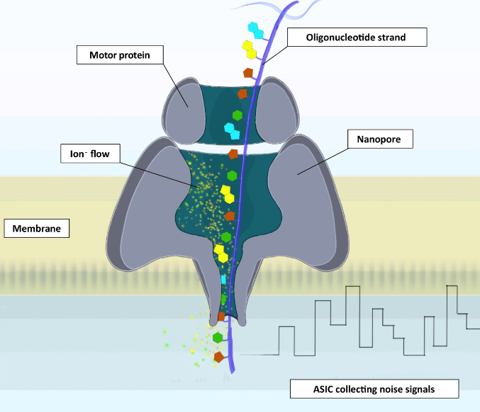
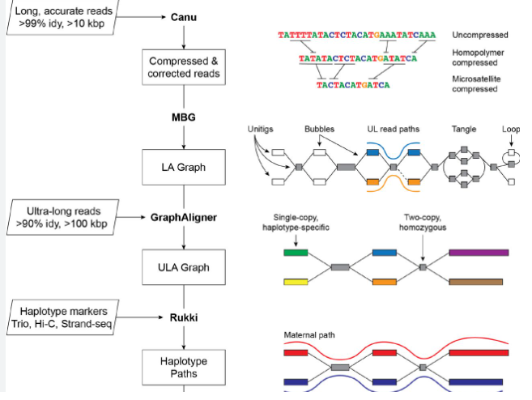
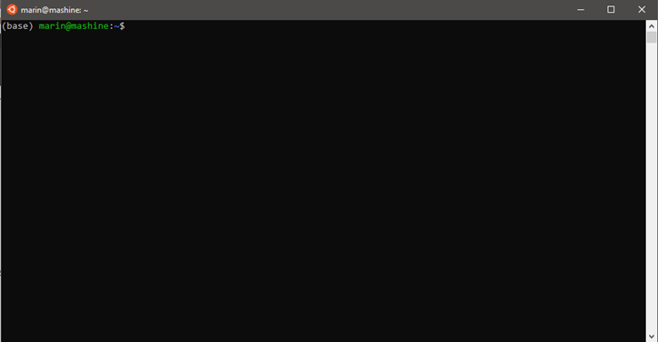

```{r xaringan-themer, include=FALSE, warning=FALSE}

library(xaringanthemer)
style_solarized_light()
```


## What is genomics?


######"Genomics is an interdisciplinary field of biology focusing on the structure, function, evolution, mapping, and editing of genomes. A genome is an organism's complete set of DNA, including all of its genes as well as its hierarchical, three-dimensional structural configuration."

### Difference between genomics and genetics?
---


## Why is it so complex?


####Maths + Computer Science + Chemistry + Biology

####You need to know both low level coding and how many chromosomes an onion has in order to be successful.


---

## The basic steps of any genomics experiments?

---
## Isolation of DNA 


---

## Sequencing


---
###Main sequencing platforms of today

So called third generation sequencing platforms:

####ONT vs. PacBio

Read length vs. quality

---
## Assembly


---

## Two types of assemblers:

-   DGB assemblers
-   OLC assemblers

Both handle unresolvable repeats by essentially leaving them out
Fragments are contigs (short for contiguous)

-   Mixed approach assemblers (verkko)

Try to brute force by read length and quality.

---
## But what is the problem?

Tandem repeats and satellites 
-   short, highly repeatable elements stretching up to 1mb in size

---

## How does the problem look?

Let's say you have a sentence:

######"The quick brown fox jumps over the lazy lazy lazy lazy dog"

but you only get at max 5-letter sized word snippets to "assemble" the sentence back from word snippets.


```{r,echo=FALSE}
library(countdown)
countdown(minutes = 1, seconds = 30)
```


---

## Maybe solvable right?

But let's include multiple chromosomes which have the same repeat:

###### "The quick brown fox jumps over the lazy lazy lazy lazy dog"

###### "The lazy lazy lazy red lion flies under the lazy cat"

but you only get at max 5-letter sized word snippets to "assemble" the sentence back from word snippets.

```{r,echo=FALSE}

countdown(minutes = 0, seconds = 30)
```


---

But some very smart people have managed to really make breaking progress into solving the problems.

They also give free research software for people to use.

However most software does not come on your phone or even with a GUI

---

That's why if you want to do real bioinformatics you need the (almost) magical tool:


---

# Linux terminal

---

What even is a "terminal" or "console"?



---

## Why would you use it?

-   speed
-   once learned it is 1000x more efficient than using explorer
-   best and newest programs don't have a GUI
-   one you get a hang of it you can do crazy things
---


## What will you do...

### ... in the scope of this exercise

1.  basic terminal commands
2.  basics of basics of bash scripting
3.  basic bioinformatic terminal tools
4.  genome assembly programs
---

# But first...
---

## Navigation

###File path notation

```{bash, echo = TRUE,  eval=FALSE}
path/ # ====> search in this foldewr 
./file.txt # ===> current directory prefix (./)
~/... # ===> from user Home (where we have desktop,downloads,etc)
/... # ===> most dangerous, goes from home root

```

###Going into directories

```{bash, echo = TRUE,  eval=FALSE}
#to enter a folder
cd dirname
#to go to the parent folder 
cd ..
#note that ../ syntax can be used to point to programs that you are
#searching in the parent folder
```

---
## Create or remove a directory

```{bash, echo = TRUE,  eval=FALSE}
#to create a directory
mkdir dirname
#remove any directory
rm -r dirname
#also remove a file
rm file
```

---
## Basic commands

```{bash, echo = TRUE,  eval=FALSE}

#display top 10 lines of a file
head
#bottom 10 lines of a file
tail
#copy one file to another
cp path/to/file1.txt path/to/copy.txt 
#move from file to file, also rename
mv path/to/file1.txt path/to/move.txt 
#touch a file
touch file.txt
#print file
cat file.txt 
```

---

## Git/GitHub

version control and collaboration, any serious multi-person programming project uses GitHub and you will be pulling most of your tools from either GitHub or GitLab

```{bash, echo = TRUE,  eval=FALSE}

git clone https://github.com/mvolar/bioinfo_class_2023.git

```

---

## Distribution

Source code distribution types:

-   User side compilation: most C/C++/Rust programs

-   Compiled binaries: selected programs (usually avoided)

-   Scripts: python and R scripts

### Conda

If you stay in Bioinformatics you will get to know Conda very closely

---

## Exercise 1

Git clone the lesson repository:

```{bash, echo = TRUE,  eval=FALSE}

git clone https://github.com/mvolar/bioinfo_class_2023.git

```


```{r,echo=FALSE}

countdown(minutes = 0, seconds = 30)
```

---
## Exercise 2

Go into the folder and create a new directory inside. Touch a "test.txt" file inside to see if everything works.

Next try to copy "mtcars.tsv" inside your directory. (hint use ../ notation). Show yourself the first 10 lines of the file.


```{r,echo=FALSE}

countdown(minutes = 3, seconds = 00)
```

---
# Your first command line programs


---
## grep

In this example we will learn the basics of any command line program. Grep is a good example since it is very simple and very very useful. Basic parts of a CLI command call include:

```{bash, echo = TRUE,  eval=FALSE}
grep # program invocation
    -h -i -F -R... #flags for the program
     search_regex # what we will be looking ofr
     file/or file

#output is printed by default on the screen
#most programs have -h flag which gives insight into the usage of the command
```

---

## Exercise 3

Print all the lines which have "Merc" string in the "mtcars.tsv" file.

Using "-h" flag for the grep command find the appropriate flag for counting the number of occurrences and count all the occurrences of word.


```{r,echo=FALSE}

countdown(minutes = 3, seconds = 00)
```

---

## Piping and redirecting

"|" is the pipe operator

">" is the redirection operator

">>" is the append operator

```{bash, echo = TRUE,  eval=FALSE}

cat "hello world" > test1.txt

```
---
## Exercise 4

Put all Mazda car lines in a seperate file named "mazda_mtcars.tsv"

How many lines does it have?

```{r,echo=FALSE}

countdown(minutes = 3, seconds = 00)
```

---
# Bash scripting

### When you don't want to do the same thing 100 times...
---

Lets say you have 20 samples, all in separate folders, but you are only interested in doing something with one file

Would you run the same thing 20 times? Or would you look for an alternate way?

---
## What are bash scripts

Bash scripts are small files with .sh extension which have a main purpose of controlling and running multiple commands in a sequential pattern

For most biological purposes you need to only know basic looping (if and for looping) and command names with variable user input and/or flags.

---


# If loops

```{bash, echo = TRUE,  eval=FALSE}

#!/bin/bash
a=17
if [a%2==0]
then
  echo "a is even" 
else
  echo "a is odd"
fi
done

```

---


# For loops 

```{bash, echo = TRUE,  eval=FALSE}

#!/bin/bash
echo "Hello world"
for i in {0..10} #from 0 to 10
do
  echo "Welcome $i times" # the dollar operator allows calling variables
done

```


---

## Exercise 5

Create a bash script which asks user input and creates that many files empty files in a new directory. (hint use "read" function to get and store the read variable in your program)


```{r,echo=FALSE}

countdown(minutes = 3, seconds = 00)
```

---

```{bash, echo = TRUE,  eval=FALSE}
#!/bin/bash
echo "give me a number"
read var
for i in {0..$var} #from 0 to 10
do
  echo "created $i"
  touch $var.txt # the dollar operator allows calling variables
done


```

---
# Command line options
---

Almost all programming langauges have command line option available for writing and deploying code (so does R, python and BASH).

It is the most frequent way of reproducibly asking user input and running a script, BOTH FOR DEVELOPERS AND USERS.

Create a new file called test.sh and put this in
```{bash, echo = TRUE,  eval=FALSE}
#!/bin/bash
echo "Argument 0 is"
echo $0
echo "Argument 1 is"
echo $1
```

now run the script using

```{bash, echo = TRUE,  eval=FALSE}
bash test.sh "hello"
```

---
## Exercise 6

Create a bash script which takes in an option either "add" or "subtract" and 2 numbers. It reports prints either the sum or the difference between the 2 numbers based on user input.


```{r,echo=FALSE}

countdown(minutes = 6, seconds = 00)
```

---

---
#Genomics tools

---
## Processing reads

The best (currently available) tool is seqtk:

```{bash, echo = TRUE,  eval=FALSE}

git clone https://github.com/lh3/seqtk.git;
cd seqtk; make

```

---

## A plethora of abilities


```{bash, echo = TRUE,  eval=FALSE}

seqtk seq -a in.fq > out.fa #convert fastq to fasta

seqtk subseq in.fq name.lst > out.fq #use a name list to filter out reads

seqtk subseq in.fa reg.bed > out.fa #extract only regions specified 
#in the bed file

seqtk sample -s100 read1.fq 10000 > sub1.fq #sample reads

```

---
## But I can do that using python/R/Galaxy/Excel/manually!

Yes you can. But sometimes you are on a server with limited computing resources and your data is simply to large to be going back and forth. 

---
## Exercise 7

Convert reads.fastq to fasta reads and sample only 30 reads from the file. Use piping to place them all in a single file called reads.fasta

```{r,echo=FALSE}

countdown(minutes = 5, seconds = 00)
```

---
## Exercise 8

Create a fasta name list from "test_reads.fasta" using grep. Visually inspect the fasta name list. Filter only reads which have a number > 999 in their names (you can use regex expressions in grep also). Afterwards filter only those with a length > 1000bp. Use both grep and seqtk to achieve this.

```{r,echo=FALSE}

countdown(minutes = 15, seconds = 00)
```

---

#Genome mapping


Usually each read type has it's own settings in mappers or event different mappers. 

Two main mappers:
    -   Minimap2 -long  
    -   Bowtie2 - short


---
# Output types

## PAF

## BAM

## SAM

---

##Exercise 9

Download minimap2 from the official github repo. Map query.fasta onto target.fasta. Using help create all three separate output formats. Visually inspect them using either cat or gedit. 

```{r}
countdown(minutes = 7, seconds = 00)
```


---

#Genome assembly

---

## Same basic principles:

- Longest possible
- Try to "bridge the gap"
- Least amount of errors
- Splitting haplotypes
- Hybrid assembly approaches


---

## List of currently best assemblers:

- Canu (verkko)
- Hifiasm
- Flye
- SPAdes


---

All are command line tools, although some are available on galaxy, however performance for full genome assembly of even small metagenomes is really underwhelming. 

All have extensive available documentation available which you can get by simple google-ing of the names.

---

#Homework:

####Task1. From the file total.fastq, separate the reads on 2 different groups that you get from visually inspecting them. Use Canu to assemble one group and use hifiasm to assemble the other group.

####Task2. Create a simple bash script using command line options which asks the user for input reads and one assembler. This is for passing. For any additional points consider adding read prefiltering based on leghts, name list, read sampling options, your own help dialog which gets activated on "-h" flag. 

This is basically designing your own command line tool. Adding "flags" instead of positional arguments is also appreciated (use getopts for bash).

